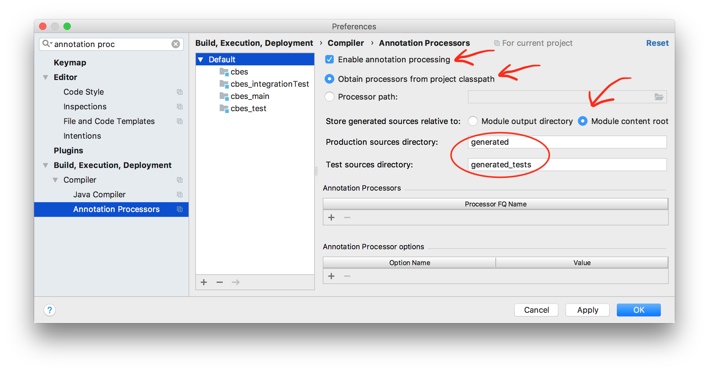

When importing the Gradle project, make sure to enable:

- [x] "Create separate module per source set".

Then go to `Preferences > Project Settings > Compiler > Annotation Processors` and make it look like this:

