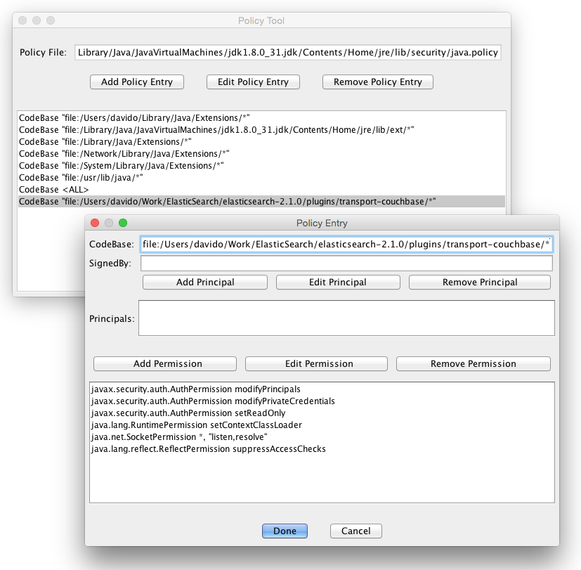

Couchbase Transport Plugin for Elasticsearch
=================================================

For a pre-built binary package and instruction manual, see the [Couchbase Downloads Page](http://www.couchbase.com/nosql-databases/downloads) and the [Couchbase Connector Guide for Elasticsearch](http://developer.couchbase.com/documentation/server/4.0/connectors/elasticsearch-2.1/elastic-intro.html)

This plugin makes your Elasticsearch node appear like a Couchbase Server node.  After installation you can use the Cross-Datacenter Replication (XDCR) feature of Couchbase Server to transfer data continuously.

Installation
============

Note that as of Elasticsearch version 2.0, plugins are version specific. This means that each minor version of Elasticsearch has a corresponding version of the plugin. For example, ES 2.3.1 works with plugin version 2.2.3.1 and so on. 

As of ES 2.2, the plugin versions are aligned to be 2.`<ES_VERSION>`, so to install for ES 2.2+, use the following command and replace `<ES_VERSION>` with your ES version:

    bin/plugin install https://github.com/couchbaselabs/elasticsearch-transport-couchbase/releases/download/2.<ES_VERSION>/elasticsearch-transport-couchbase-2.<ES_VERSION>.zip

You will be asked to approve additional permissions required by the plugin, please do so.

To install the ES 2.1.1 compatible version, run the following command from your Elasticsearch installation folder:

    bin/plugin install https://github.com/couchbaselabs/elasticsearch-transport-couchbase/releases/download/v2.2.1.2/elasticsearch-transport-couchbase-2.2.1.2.zip

To install the ES 1.x compatible plugin, run the following command from your Elasticsearch installation folder:

    bin/plugin -i transport-couchbase -url http://packages.couchbase.com.s3.amazonaws.com/releases/elastic-search-adapter/2.1.2/elasticsearch-transport-couchbase-2.1.2.zip
    

Version Compatibility:

    +------------------------------------------------------------------+
    |  Plugin                       |  Couchbase    | Elasticsearch    |
    +------------------------------------------------------------------+
    | master                        |  2.5.x - 4.x  | 2.4.0            |
    +------------------------------------------------------------------+
    | 2.5.0.0-alpha2                |  2.5.x - 4.x  | 5.0.0-alpha2     |
    +------------------------------------------------------------------+
    | 2.2.x.y                       |  2.5.x - 4.x  | 2.x.y            | 
    +------------------------------------------------------------------+
    | 2.1                           |  2.5.x - 4.x  | 1.3.0 - 1.7.x    |
    +------------------------------------------------------------------+
    | 2.0                           |  3.x, 2.5.x   | 1.3.0            |
    +------------------------------------------------------------------+
    
# Configuration #

**Important note for Elasticsearch 2.1**: Due to changes in the plugin security mechanism, when installing v2.2.0.x and v2.2.1.x of the plugin you must also edit the Java security policy to grant it appropriate permissions. See the **Java Security Policy Permissions** topic below for instructions.
 
**This workaround is not required for Elasticsearch 2.2+ with plugin 2.2.2.0+.**

Configuration for the plugin is specified as part of the Elasticsearch config file (usually elasticsearch.yml) and is currently only read when Elasticsearch starts. Dynamic configuration support is planned for the future.

## Basic Settings ##

- **couchbase.port** - The port the plugin will listen on, default `9091`
- **couchbase.username** - The username for HTTP basic auth, default `Administrator`
- **couchbase.password** - The password for HTTP basic auth, no default
- **couchbase.num_vbuckets** - The number of vbuckets that Elasticsearch should pretend to have (default on Mac is 64, 1024 on all other platforms)  This value MUST match the number of vbuckets on the source Couchbase cluster.
- **couchbase.maxConcurrentRequests** - The number of concurrent requests that the plugin will allow, default 1024 (lower this if the load on the machine gets too high)

## Advanced Settings ##

- **couchbase.ignoreFailures** - Enabling this flag will cause the plugin to return a success status to Couchbase even if it cannot index some of the documents. This will prevent the XDCR replication from being stalled due to indexing errors in Elasticsearch, for example when a schema change breaks some of the ES type mappings. Default is `false`.
- **couchbase.ignoreDeletes** - Specifying one or more index names (as a comma or semicolon delimited string) here will cause the plugin to ignore document deletion and expiration for those indexes. This can be used to turn Elasticsearch into a sort of searchable archive for a Couchbase bucket. Note that this also means that the index will continue to grow indefinitely.
- **couchbase.wrapCounters** - Enabling this flag will cause the plugin to wrap integer values from Couchbase, which are not valid JSON documents, in a simple document before indexing them in Elasticsearch. The resulting document is in the format `{ "value" : <value> }` and is stored under the ID of the original value from Couchbase.
- **couchbase.ignoreDotIndexes** - Enabled by default (`true`). Causes the plugin to completely ignore indexes/aliases whose name starts with ".", such as ".kibana", ".marvel", etc.
- **couchbase.includeIndexes** - Specifying one or more index/alias names (as a comma or semicolon delimited string) here will cause the plugin to ignore the existence of all other indexes. For example, if you have only a few indexes replicated from Couchbase, there's no reason to store checkpoint metadata in all other indexes. Note that this setting takes precedence over ignoreDotIndexes, so if you whitelist an index or alias that starts with a dot, the plugin will use it. 

### Mapping Couchbase documents to Elasticsearch types ###

- **couchbase.typeSelector** - The type selector class to use for mapping documents to types.
	- **`org.elasticsearch.transport.couchbase.capi.DefaultTypeSelector`** - Maps all documents to the specified type. As the name implies, this is the default type selector and can be omitted from the configuration file.
		- **couchbase.typeSelector.defaultDocumentType** - The document type to which the DefaultTypeSelector will map all documents. Defaults to "couchbaseDocument".
		- **couchbase.typeSelector.checkpointDocumentType** - The document type to which replication checkpoint documents will be mapped. Defaults to "couchbaseCheckpoint".
	- **`org.elasticsearch.transport.couchbase.capi.DelimiterTypeSelector`** - If the document ID is of the format `<type><delimiter><*>`, this type selector will map these documents to the type `<type>`, otherwise it will use the `DefaultTypeSelector` for the type mapping. The default delimiter is `:`, so for example a document with the ID `user:123` will be indexed under the type `user`.
		- **couchbase.typeSelector.documentTypeDelimiter** - Optional. The delimiter to use for the `DelimiterTypeSelector`. Default is `:`. 
	- **`org.elasticsearch.transport.couchbase.capi.GroupRegexTypeSelector`** - Maps documents that match the specified regular expression with a capture group named `type`. If the document doesn't match the regular expression, or the regular expression doesn't define a capture group named `type`, the `DefaultTypeSelector` is used instead.
		- **couchbase.typeSelector.documentTypesRegex** - Specified the regular expression for mapping Couchbase document IDs to Elasticsearch types. Example: `^(?<type>\w+)::.+$` will map document IDs of the format `<type>::<stuff>` to the type `<type>`, so the ID `user::123` will be indexed under the type `user`.
	- **`org.elasticsearch.transport.couchbase.capi.RegexTypeSelector`** - Maps document IDs that match the specified regular expressions to the named types. If the ID doesn't match any of the specified expressions, `DefaultTypeSeletor` is used to select the type.
		- **couchbase.typeSelector.documentTypesRegex.*** - Specifies a regular expression with a named type. For example, `couchbase.typeSelector.documentTypesRegex.users: ^user-.+$` will map all document IDs that start with the string `user-` to the type `users`.

### Mapping parent-child relationships ###

- **couchbase.parentSelector** - The parent selector class to use for mapping child documents to parents. Note that because of the nature of XDCR, it's possible that the child document will be replicated before the parent, leading to unpredictable behaviour on the Elasticsearch side.
	- **`org.elasticsearch.transport.couchbase.capi.DefaultParentSelector`** - Maps documents to parents according to a predefined map of types to field names. 
		- **couchbase.parentSelector.documentTypeParentFields.*** - Specifies which document field contains the ID of the parent document for that particular type. For example, `couchbase.parentSelector.documentTypeParentFields.order: doc.user_id` will set the parent ID of all documents in the type `order` to the value of the user_id field.
	- **`org.elasticsearch.transport.couchbase.capi.RegexParentSelector`** - Maps documents to parents according to a specified regular expression with the capture group `parent`. Optionally lets you specify the format for the parent document ID.
		- **couchbase.parentSelector.documentTypesParentRegex.*** - A named regular expression for matching the parent document ID. For example, `couchbase.documentTypesParentRegex.typeA: ^typeA::(?<parent>.+)` with the document ID `typeA::123` will use `123` as the parent document ID.
		- **couchbase.parentSelector.documentTypesParentFormat.*** - Specifies an optional format for the parent document ID matched by the regular expression above. Uses `<parent>` as the placeholder for the matched ID. For example, `couchbase.documentTypesParentFormat.typeA: parentType::<parent>` with the previous example will produce the parent document ID `parentType::123`.

### Specifying custom document routing ###

- **couchbase.documentTypeRoutingFields.*** - A mapping of types to custom document routing paths. For example, specifying `couchbase.documentTypeRoutingFields.users: user_id` will use the field `user_id` as the custom routing path for type `users`.

### Filtering documents on the Elasticsearch side ###
- **couchbase.keyFilter** - The document filter class to use for filtering documents on the plugin side. Note that Couchbase sends all documents through XDCR no matter what, the document filter simply chooses whether to index or ignore certain documents according to their ID.
	- **`org.elasticsearch.transport.couchbase.capi.DefaultKeyFilter`** - The default filter, which lets all documents through. Can be omitted from the configuration file.
	- **`org.elasticsearch.transport.couchbase.capi.RegexKeyFilter`** - The
		- **couchbase.keyFilter.type** - `[include|exclude]` Specifies whether the filter will include or exclude the documents based on the matched regular expression. If `include`, then only documents with IDs that match one of the regular expressions will be indexed. If `exclude`, then only documents that do **not** match **any** of the regular expressions will be indexed.   
		- **couchbase.keyFilter.keyFiltersRegex.*** - Specifies one or more regular expressions to match against the document ID before indexing them in Elasticsearch. For example, `couchbase.keyFilter.type: exclude` + `couchbase.keyFilter.keyFiltersRegex.temp: ^temp.*$` will cause the plugin to ignore any documents whose IDs start with `temp`.

## Java Security Policy Permissions ##

In order to get the plugin to work with ES 2.1.x, it is necessary to edit the system's default `java.policy` file, which is located in the `%JAVA_HOME%/jre/lib/security` directory. You can either edit this file directly, or use the `policytool` utility, which can be found in the `%JAVA_HOME%/bin` directory. Note that editing the policy file requires root permissions.
If you're editing the policy file directly, add the following to the end of the file:

    grant codeBase "file:/<path to transport-couchbase plugin install directory>/*" {
      permission javax.security.auth.AuthPermission "modifyPrincipals";
      permission javax.security.auth.AuthPermission "modifyPrivateCredentials";
      permission javax.security.auth.AuthPermission "setReadOnly";
      permission java.lang.RuntimePermission "setContextClassLoader";
      permission java.net.SocketPermission "*", "listen,resolve";
      permission java.lang.reflect.ReflectPermission "suppressAccessChecks";
    };
    
Replace `file:/<path>/*` with the directory where you installed the plugin. For example, if you installed Elasticsearch from as a deb/rpm package on Linux, this would be `file:/usr/share/elasticsearch/plugins/transport-couchbase/*` - note the trailing `*`, which means that the policy will apply to all files in that directory. 

If you prefer to use the GUI applet, run specify the location of the policy file with the `-file` parameter, for example:
    
    sudo $JAVA_HOME/bin/policytool -file $JAVA_HOME/jre/lib/security/java.policy 

When the applet window appears, verify that the Policy File textbox shows the name of the policy file you're going to edit. To add the required security settings click on the "Add Policy Entry" button. In the new "Policy Entry" window that will appear, fill in the CodeBase textbox with the URL path to the plugin's installation directory, as explained above.
Next, add each of the following permissions by clicking on the "Add Permission" button for each, then selecting the specified options:

    1.)  permission javax.security.auth.AuthPermission "modifyPrincipals";
    
         From the "Permission:" dropdown select:
         
            AuthPermission
         
         From the "Target Name:" dropdown select:
         
            modifyPrincipals
         
         Click "Ok"

    2.)  permission javax.security.auth.AuthPermission "modifyPrivateCredentials";
    
         From the "Permission:" dropdown select:
         
            AuthPermission
         
         From the "Target Name:" dropdown select:
         
            modifyPrivateCredentials
         
         Click "Ok"

    3.)  permission javax.security.auth.AuthPermission "setReadOnly";
    
         From the "Permission:" dropdown select:
         
            AuthPermission
         
         From the "Target Name:" dropdown select:
         
            setReadOnly
         
         Click "Ok"

    4.)  permission java.lang.RuntimePermission "setContextClassLoader";
    
         From the "Permission:" dropdown select:
         
            RuntimePermission
         
         From the "Target Name:" dropdown select:
         
            setContextClassLoader
         
         Click "Ok"
	
    5.)  permission java.net.SocketPermission "*", "listen,resolve";
    
         From the "Permission:" dropdown select:
         
            SocketPermission
         
         In the "Target Name:" textbox type:
         
            *
         
         In the "Actions:" dropdown type:
         
            listen,resolve
         
         Click "Ok"
	
    6.)  permission "java.lang.reflect.ReflectPermission" "suppressAccessChecks";
    
         From the "Permission:" dropdown select:
         
            ReflectPermission
         
         From the "Target Name:" dropdown select:
         
            suppressAccessChecks
         
         Click "Ok"

At the end of the process, your policy tool should look similar to this:

Click "Done" to close the "Policy Entry" window and then select "Save" from the File menu of the "Policy Tool" window. Close the `policytool` utility when you're finished.

Couchbase Document Expiration
=============================

If you use the document expiration feature of Couchbase Server to expire documents after a specified TTL, you must enable the corresponding feature in your Elasticsearch mapping.  There is some cost associated with enabling this feature, so it is left disabled by default.

See this page in the Elasticsearch guide for more information about enabling this feature:

http://www.elasticsearch.org/guide/reference/mapping/ttl-field.html

Usage
=====

Preparing Elasticsearch

1. Install the plugin on each node in your cluster.
2. Install the Couchbase template
    curl -XPUT http://localhost:9200/_template/couchbase -d @plugins/transport-couchbase/couchbase_template.json
3. Create an Elasticsearch index to store the data from Couchbase (ie. default)

Preparing Couchbase

1. Navigate to the Couchbase Server admin interface.
2. Select the Replications tab.
3. Press the button labeled "Create Cluster Reference"
4. Choose a name for your Elasticsearch cluster
5. In the IP/Hostname and field provide an address and port of one of the nodes in your ES cluster (127.0.0.1:9091)
6. Enter the Username and Password corresponding to your "couchbase.username" and "couchbase.password" settings in Elasticsearch
7. Press the "Save" button

Starting Data Transfer

1. Press the button labeled "Create Replication"
2. Select the bucket from source cluster you wish to send to Elasticsearch
3. Next select the cluster you defined in step 4.
4. Type in the name of the Elasticsearch index you wish to store the data in.  This index must already exist.
5. If you are using Couchbase Server 2.2 or later, click Advanced settings and change the XDCR Protocol setting to Version 1

Building
========

This module is built using maven.  It depends on another project which is not in any public maven repositories, see https://github.com/couchbaselabs/couchbase-capi-server and run `mvn install` on that first.

Then in this project run

    mvn package
    
The final plugin package will be in the target/releases folder.
