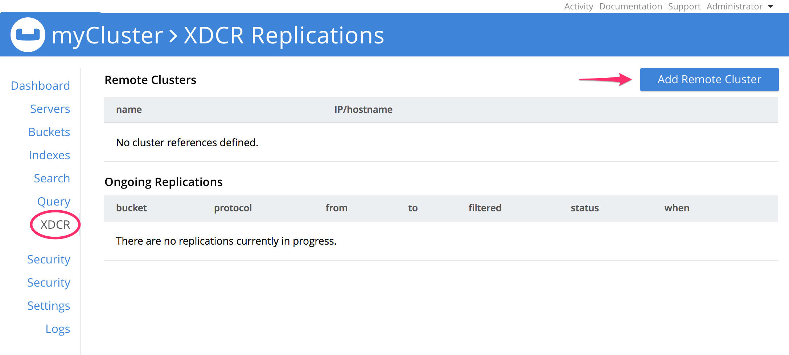
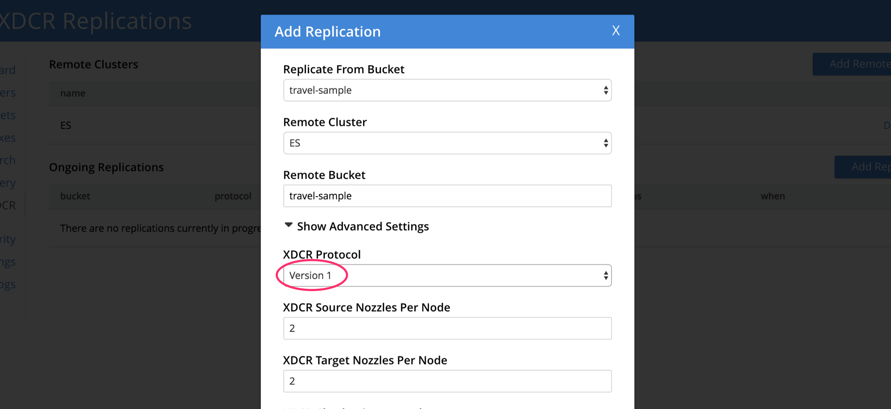

---
---

A Couchbase-Elasticsearch data-replication system consists of three principal components:

- a **Couchbase Server cluster** of one or more nodes
- an **Elasticsearch cluster** of one or more nodes
- the **Elasticsearch Transport Plug-in**, installed in the Elasticsearch environment.

This section provides step-by-step instructions to install the Couchbase Elasticsearch plugin.

## Plugin pre-requisites

- Java (see [installation guide](https://docs.oracle.com/javase/8/))
- Download and install Elasticsearch =< 5.x (see [installation guide](https://www.elastic.co/guide/en/elasticsearch/reference/5.6/install-elasticsearch.html), Elasticsearch 6.0 is not supported by the plugin)
- Download and install Couchbase Server >= 3.0 (see [installation guide](https://www.couchbase.com/downloads))

Verify the Elasticsearch cluster is up and running (the default port is `9200`).

```bash
$ curl localhost:9200

{
  "name" : "K3RqW4F",
  "cluster_name" : "elasticsearch",
  "cluster_uuid" : "Bw-Ta0wDTcekzQIhXZHGkg",
  "version" : {
    "number" : "5.6.5",
    "build_hash" : "6a37571",
    "build_date" : "2017-12-04T07:50:10.466Z",
    "build_snapshot" : false,
    "lucene_version" : "6.6.1"
  },
  "tagline" : "You Know, for Search"
}
```

Verify that Couchbase Server is running.

```bash
$ curl localhost:8092

{"couchdb":"Welcome","version":"v4.5.1-60-g3cf258d","couchbase":"5.0.2-5506-community"}
```

## Installation

Navigate to the Elasticsearch installation directory.

```bash
$ cd /usr/share/elasticsearch
```

Download and install the plug-in package.

```bash
$ bin/elasticsearch-plugin install https://github.com/couchbaselabs/elasticsearch-transport-couchbase/releases/download/3.0.0-cypress/elasticsearch-transport-couchbase-3.0.0-cypress-es5.6.4.zip
```

Replace the plugin URL with the one that matches your Elasticsearch version, all URLs can be found on the [releases page](https://github.com/couchbaselabs/elasticsearch-transport-couchbase/releases).

When the installation is successful, the message "Installed transport-couchbase into /usr/share/elasticsearch/plugins/transport/couchbase" will be logged.

## Configuration

Open the Elasticsearch configuration file (**/etc/elasticsearch/elasticsearch.yml**) and add the following to the end of the file.

```yaml
couchbase.username: <USERNAME>
couchbase.password: <PASSWORD>
couchbase.maxConcurrentRequests: 1024
```

The **username** and **password** credentials will be used again later when configuring Couchbase Server.

Still in the **/usr/share/elasticsearch** directory, configure the Elasticsearch plugin with the following curl command.

```bash
$ curl -X PUT http://localhost:9200/_template/couchbase -d @plugins/transport-couchbase/couchbase_template.json
```

When successful, the configuration-routine provides the following response: `{"acknowledged":true}`.

Create an Elasticsearch index to receive the data from the Couchbase bucket. Later, when configuring XDCR, the "remote bucket name" should match the Elasticsearch **index name**.

```bash
$ curl -X PUT http://localhost:9200/travel-sample

{"acknowledged":true}
```

Now to configure Couchbase Server, open the Couchbase Web Console and select **XDCR > Add Remote Cluster**.



In the dialog, enter the **Cluster Name** of your choice, the **IP/hostname** and port number where the Elasticsearch cluster is running (the Elasticsearch plugin listens on port 9091 by default) and the **Username**/**Password** previously stored in **elasticsearch.yml**.


Next, select the **Add Replication** option.


In the pop-up window, enter the origin bucket, the remote cluster and remote bucket (in this case it's the index created earlier). Also make sure that the **XDCR Protocol** version is set to 1 and click **Save**.



Now that the replication is up and running, you can run full-text search queries on the Elasticsearch node.

```bash
$ curl localhost:9200/travel-sample/_search?q=san+francisco

{
	"took":5,
	"timed_out":false,
	"_shards":{"total":5,"successful":5,"skipped":0,"failed":0},
	"hits":{
		"total":1599,
		"max_score":11.965878,
		"hits":[
			{"_index":"travel-sample","_type":"couchbaseDocument","_id":"landmark_36047","_score":11.965878,"_source":{"meta":{"rev":"1-1508c18bdbb400000000000002000000","flags":33554432,"expiration":0,"id":"landmark_36047"}}},
			{"_index":"travel-sample","_type":"couchbaseDocument","_id":"landmark_25611","_score":11.905596,"_source":{"meta":{"rev":"1-1508c18bb43400000000000002000000","flags":33554432,"expiration":0,"id":"landmark_25611"}}},
			{"_index":"travel-sample","_type":"couchbaseDocument","_id":"landmark_25712","_score":11.905596,"_source":{"meta":{"rev":"1-1508c18bb61e00000000000002000000","flags":33554432,"expiration":0,"id":"landmark_25712"}}}
			...
		]
	}
}
```